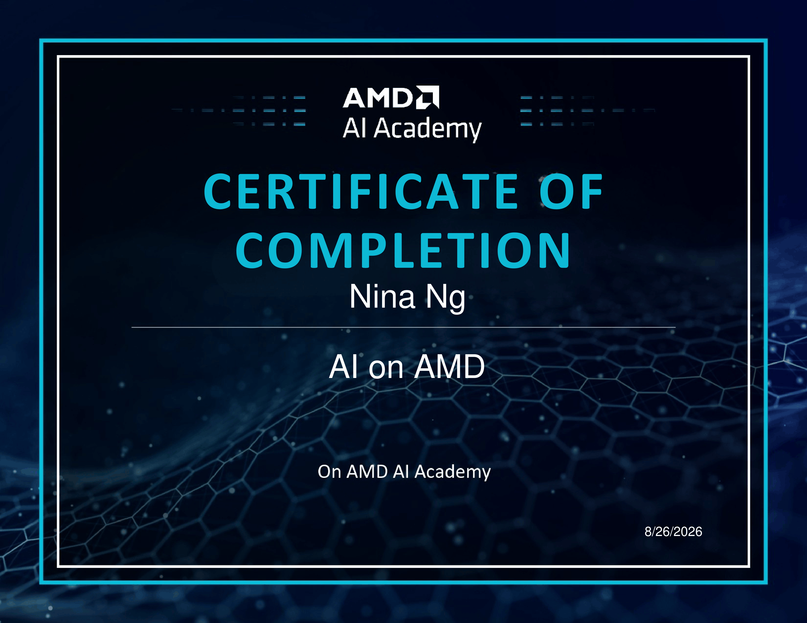

# AI Chatbot on AMD MI300 🚀

A hands-on Generative AI project completed as part of the **AI on AMD** course from AMD AI Academy.

This project explores how a pretrained Large Language Model can be deployed for inference on AMD GPU infrastructure using **Qwen 3**, **vLLM**, and an **AMD Instinct MI300 GPU**.

As part of the lab, I also customized the chatbot into a **SQL & Data Analyst Assistant** to connect Generative AI with my data analytics learning.

---

## 🎯 What I Built

- Ran Qwen 3 on an AMD Instinct MI300 GPU
- Performed LLM inference using vLLM
- Built a chatbot with conversation history
- Used system prompts to customize AI behavior
- Created a SQL & Data Analyst Assistant
- Experimented with `temperature`, `max_tokens`, and `top_p`
- Built an interactive chatbot interface using `ipywidgets`

---

## 🤖 SQL & Data Analyst Assistant

I customized the system prompt to create an assistant focused on SQL and data cleaning.

```python
my_conversation = [
    {
        "role": "system",
        "content": """
        You are a Data Analyst specialized in SQL.
        You help users clean data, deal with NULL values and missing values,
        and standardize data.
        Explain concepts simply to beginners and provide SQL examples when needed.
        """
    }
]
```

Example question:

```text
How should I handle NULL values in a country column?
```

This experiment connected LLM prompting with practical data-cleaning concepts such as missing values, NULL handling, and data standardization.

---

## 🎛️ LLM Parameters

I experimented with three common generation parameters:

| Parameter | Purpose |
|---|---|
| `temperature` | Controls randomness and creativity |
| `max_tokens` | Controls maximum response length |
| `top_p` | Controls token selection diversity |

For example:

```python
sampling_params = SamplingParams(
    temperature=0.2,
    max_tokens=200,
    top_p=0.9
)
```

A lower temperature can be useful for a SQL-focused assistant where more consistent and focused responses are preferred.

---

## 🖥️ Interactive Chatbot

The final part of the project uses `ipywidgets` to create a simple graphical interface where users can:

- Enter a prompt
- Adjust temperature
- Adjust maximum tokens
- Adjust top-p
- Send the prompt to Qwen 3
- View the generated response

---

## 🧠 What I Learned

### LLM Inference

Inference means using an already-trained model to generate outputs from new inputs.

In this project:

```text
User Prompt
     ↓
System Prompt / Conversation
     ↓
Sampling Parameters
     ↓
Qwen 3
     ↓
vLLM
     ↓
AMD MI300 GPU
     ↓
Generated Response
```

### System Prompts

System prompts can change the role and behavior of an LLM without retraining the model.

### Generation Parameters

I learned how `temperature`, `max_tokens`, and `top_p` influence the model's responses.

### Training vs. Inference

This project uses a **pretrained model for inference**. It does not train Qwen 3 from scratch.

---

## 🛠️ Technologies

- Python
- Qwen 3
- vLLM
- AMD Instinct MI300 GPU
- AMD Developer Cloud
- Jupyter Notebook
- ipywidgets
- Generative AI / LLM Inference

---

## 📂 Repository

```text
amd-ai-chatbot-lab/
│
├── README.md
├── chatbot_vllm.ipynb
├── screenshots/
└── certificate/
```

---

## 🎓 Course

**AI on AMD — AMD AI Academy**

Completed: **August 2026**

The hands-on lab covered Generative AI inference, system prompting, generation parameters, vLLM, and running an LLM workload on AMD hardware.

### Certificate



**Certificate of Completion — AI on AMD, AMD AI Academy**  
Completed: August 2026
---

## 📌 Note

This repository documents my hands-on learning from the **AMD AI Academy** lab.

The original course materials and learning environment were provided by AMD. My work included completing the exercises, experimenting with generation parameters, and customizing the chatbot into a SQL & Data Analyst Assistant.
